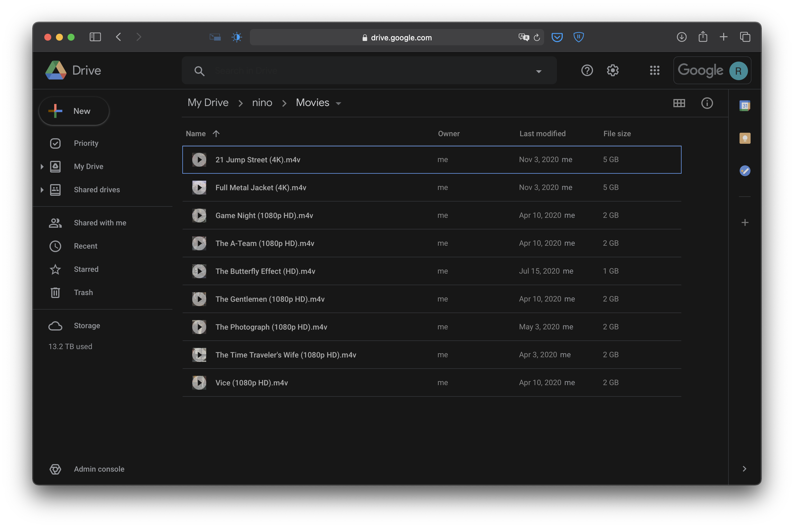
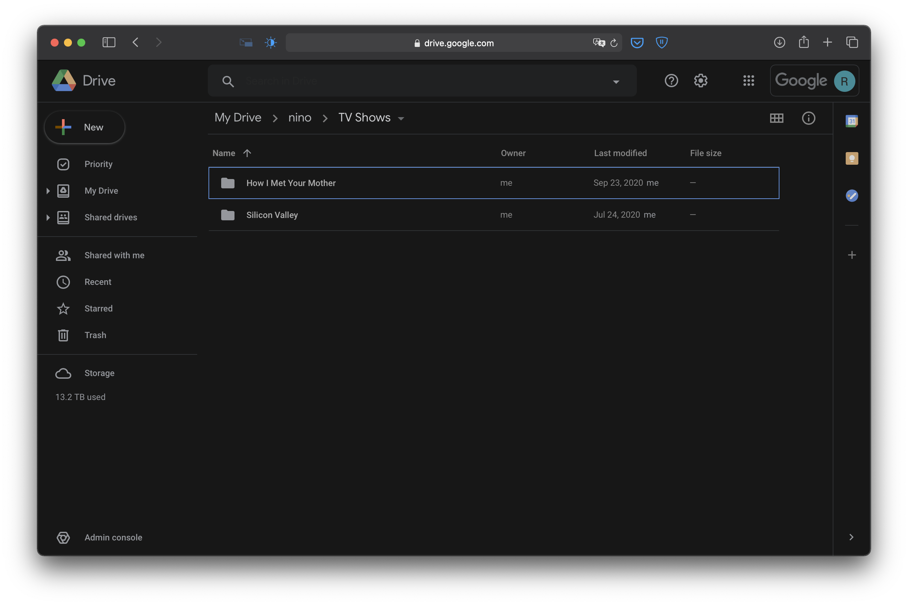
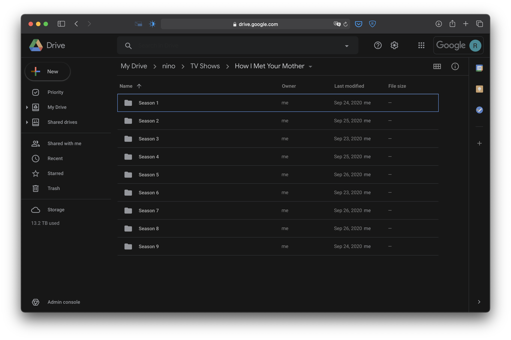
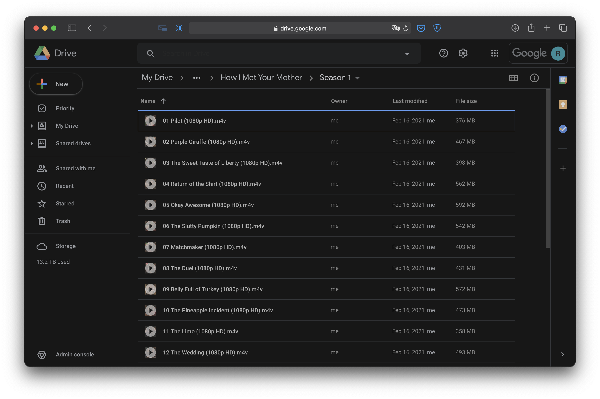
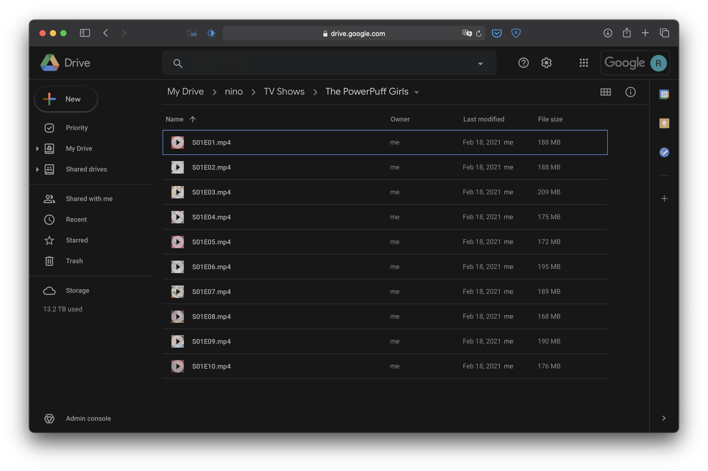
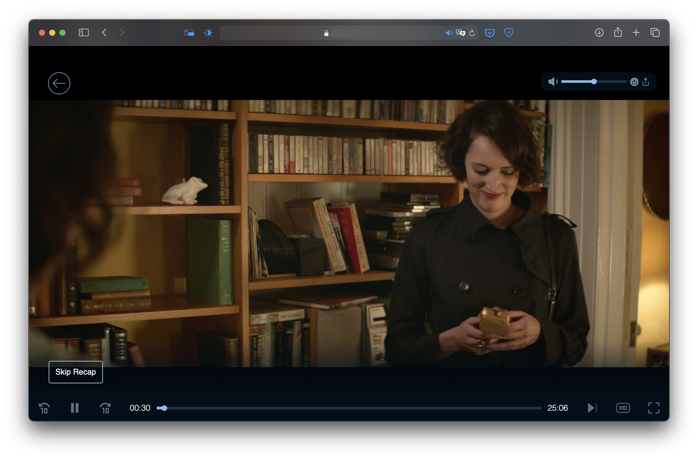

# nino
Nino is a VOD streaming service built around the Google Drive API with nodeJs

### What is nino and how does it work ?
Nino is a web application that allows you to store, organise, download and stream media contents available on your Google Drive.
The application enables you share this library without compromising the integrity of the original files.
It organises the Movies and TV shows on your drive account, providing you with their trailer, HD images and other info

#### Setup
* For setup clone the repo, install the dependencies and run "npm run start"
* visit http://localhost:5000
* Follow the setup process in the browser
* Replace the nino.json file in the config folder
* Close the server and run "npm run start" 
* To scan your library or perform any admin task, visit http://localhost:5000/update (from here you can access other admin pages)
* To create auth keys log in as admin and visit http://localhost:5000/auth/generateKey

#### How to arrange the files
* For movies, it is imperative that only the movie file itself is placed directly in the movie folder like so 
* For TV shows every Show should be placed in its folder like so 
* When arranging the episodes you have two options
    * Place each episode in its corresponding Season folder, like so (Recommended)  
    * Alternatively you can place them directly in the Show folder but only if they can pass this s|SXX .. eE|XX naming scheme, for example;
        * S01 - E01
        * S01 randomText E01  
        * s01e01 | S01E01
    like so 

## Some Features of nino
* The boarding page 
* The boarding page 
* The boarding page 
* The homepage after authentication with some segments shown 
* Some more segments shown 
* Some more segments shown with youtube trailers 
* The active search feature 
* This is how media metadata is displayed on nino  
* Viewing more details on selected media 
* Clicking on an actor or someone from the production team shows 
* Clicking on their videography 
* Clicking on a production company show 

#### Some images from the video player
* Preview frame 
* Up next button 
* Video paused 
* Downloading videos require an auth key from the admin 
* Videos can be shared from current position or from the beginning (no authentication required for sharing or viewing) 
* Not available on this version of nino is subtitles 
* You can skip recaps for TV Episodes 
* When a video buffers 
* Nino plays the next video once current video has been completely seen 
